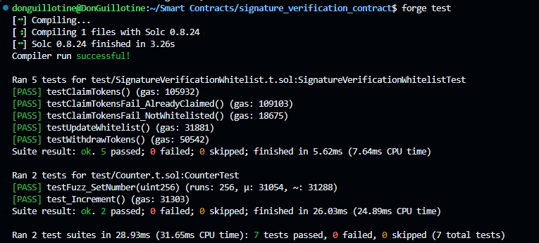

# Signature Verification Whitelist

This project implements a smart contract for a token claim system with signature verification and whitelisting functionality. It's built using Solidity and tested with the Foundry framework.

## Overview

The `SignatureVerificationWhitelist` contract allows whitelisted users to claim ERC20 tokens by providing a signed message. The contract verifies the signature, checks if the signer is whitelisted, and then transfers the tokens if all conditions are met.

## Features

- ERC20 token integration
- Signature verification using ECDSA
- Whitelist management
- One-time token claiming per address
- Owner-only functions for whitelist management and token withdrawal

## Requirements

- Solidity ^0.8.24
- Foundry
- OpenZeppelin Contracts v5.0.0

## Installation

1. Clone the repository:
   ```
   git clone https://github.com/DonGuillotine/signature-verification-smart-contract.git
   cd signature-verification-smart-contract
   ```

2. Install dependencies:
   ```
   forge install
   ```

## Contract Structure

- `SignatureVerificationWhitelist.sol`: Main contract implementing the token claim system
- `MockERC20.sol`: A simple ERC20 token for testing purposes

## Key Functions

- `claimTokens(bytes32 messageHash, bytes memory signature)`: Allows whitelisted users to claim tokens
- `updateWhitelist(address account, bool isWhitelisted)`: Adds or removes addresses from the whitelist
- `withdrawTokens(uint256 amount)`: Allows the owner to withdraw tokens from the contract

## Testing

The project includes a comprehensive test suite in `SignatureVerificationWhitelist.t.sol`. To run the tests:

```
forge test
```

All tests passed




## Usage

1. Deploy the `SignatureVerificationWhitelist` contract, providing the ERC20 token address and the amount of tokens to be claimed.
2. Use the `updateWhitelist` function to add addresses to the whitelist.
3. Users can claim tokens by calling `claimTokens` with a signed message hash and its corresponding signature.

## License

This project is licensed under the MIT License.

## Contributing

Contributions are welcome! Please feel free to submit a Pull Request.

## Disclaimer

This software is provided "as is", without warranty of any kind, express or implied. Use at your own risk.
